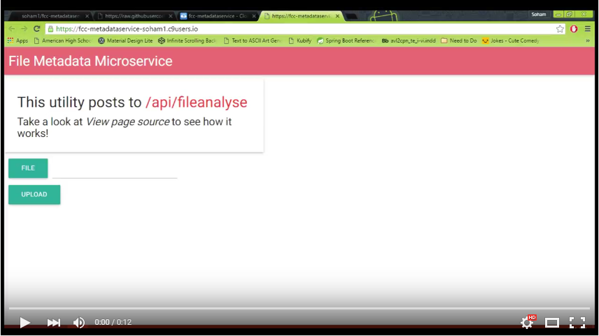

# Metadata Service

This is a solution for https://www.freecodecamp.com/challenges/file-metadata-microservice

User Story: I can submit a FormData object that includes a file upload.

User Story: When I submit something, I will receive the file size in bytes within the JSON response

## Screenshots:

### Homepage

### User selects a file they want to measure.

### A dialog box appears with the size of the file in MB.

## Demo

## Technologies Used:
- Node.js
- Express
- Multer
